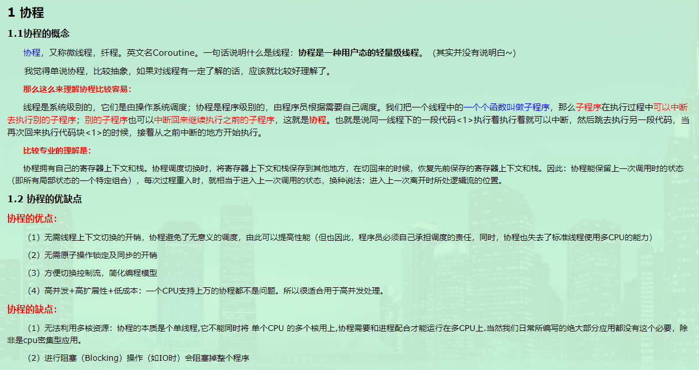

* [ORM](https://en.wikipedia.org/wiki/Object-relational_mapping)

对象关系映射（Object Relational Mapping，简称ORM，或O/RM，或O/R mapping），是一种程序技术，用于实现面向对象编程语言里不同类型系统的数据之间的转换。从效果上说，它其实是创建了一个可在编程语言里使用的“虚拟对象数据库”。

问题的核心在于将对象的逻辑表示转换为能够存储在数据库中的原子化形式，同时保留对象的属性及其关系，以便在需要时将它们作为对象重新加载。

实现实体的属性与关系型数据库字段的映射，CRUD可以交由ORM生成的代码方式实现，也就是将实体的变化翻译成SQL脚本之后执行到数据库中去，隐藏了数据访问细节，是“封闭”的通用数据库交互。
* 连接池

连接池是维护的数据库连接的缓存，以便在将来需要对数据库发起请求时可以重用连接。

[aiomysql pool](https://aiomysql.readthedocs.io/en/latest/pool.html)
* [事务](https://dev.mysql.com/doc/refman/8.0/en/glossary.html#glos_transaction)

事务是一组可提交、可回滚的连续的数据库操作操作，就像它是一个单独的工作单元一样。换句话说，除非组内的每个单独操作都成功，否则事务永远不会完成。

atomicity(原子性), consistency(一致性), isolation(隔离性), and durability(持久性).

autocommit自动提交模式：除非显式地开始一个事务，否则每个查询都被当做一个单独的事务自动执行。
* [游标](https://dev.mysql.com/doc/refman/8.0/en/cursors.html)

游标是一个可读的标识，用来标识数据读取到的位置。

[游标通常有三种](https://www.databasejournal.com/features/mysql/perform-row-operations-using-mysql-cursors.html),"sensitive", "insensitive", "asensitive"; MySQL为asensitive.

游标的三个特性

Asensitive: The server may or may not make a copy of its result table

Read only: Not updatable

Nonscrollable: Can be traversed only in one direction and cannot skip rows
* [协程](https://www.liaoxuefeng.com/wiki/0014316089557264a6b348958f449949df42a6d3a2e542c000/001432090171191d05dae6e129940518d1d6cf6eeaaa969000)

如果对上面链接中的例子理解有困难，可以使用 `python -m trace --trace coroutine.py`将详细的执行步骤打印出来。

协程看上去也是子程序，但执行过程中，在子程序内部可中断，然后转而执行别的子程序，在适当的时候再返回来接着执行。

[协程及Python中的协程](https://www.cnblogs.com/zingp/p/5911537.html)
* [主键](https://www.techonthenet.com/mysql/primary_keys.php)

表中每一行都应该有可以唯一标识自己的一列（或一组列）。

主键用于索引，需要满足以下条件：

>①任何两行都不具有相同的主键值

>②每个行都必须具有一个主键值（主键列不允许NULL值）

>③不更新、重用主键列的值

>④不在主键列中使用可能会更改的值

>⑤无特殊需求下Innodb建议使用与业务无关的自增ID作为主键
* [@classmethod and @staticmethod](https://stackoverflow.com/questions/12179271/meaning-of-classmethod-and-staticmethod-for-beginner)

@classmethod修饰的方法是类专属的，且可以通过类名进行调用，没有此参数指定的类的方法为实例方法。它的好处在于重构类时不需要修改构造函数，额外添加需要处理的函数，并使用装饰符@classmethod即可。

classmethod must have a reference to a class object as the first parameter, whereas staticmethod can have no parameters at all.
